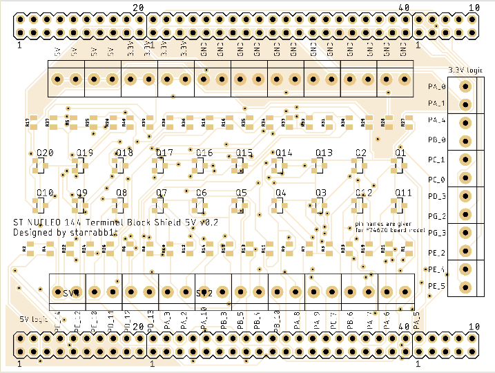

# Bi-directional-logic-level-converter

The PCB here is extension for ST NUCLEO 144 Boards to work with 5V periphery. There are twenty 5V-tolerant pins, that connected to controller via BSS138 MOSFET. There are also twelve pins with 3.3V logic only.  

There are all gerbers you need to make PCB in the repo. 

Details you need to solder PCB:
- BSS138 (x20)
- 10K resistor (x40)
- Terminal block 3.5мм (x26)
- 
